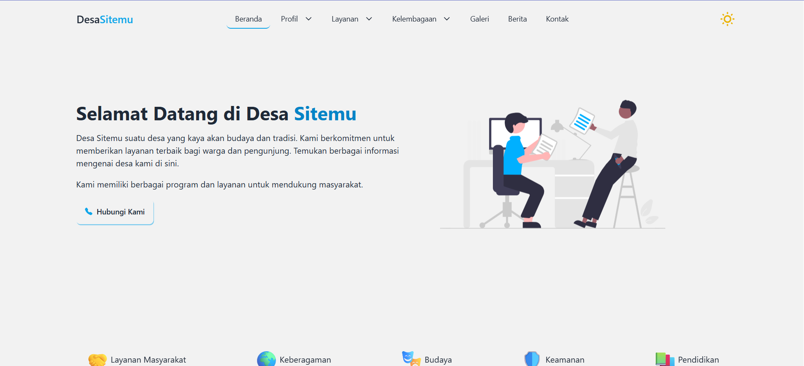
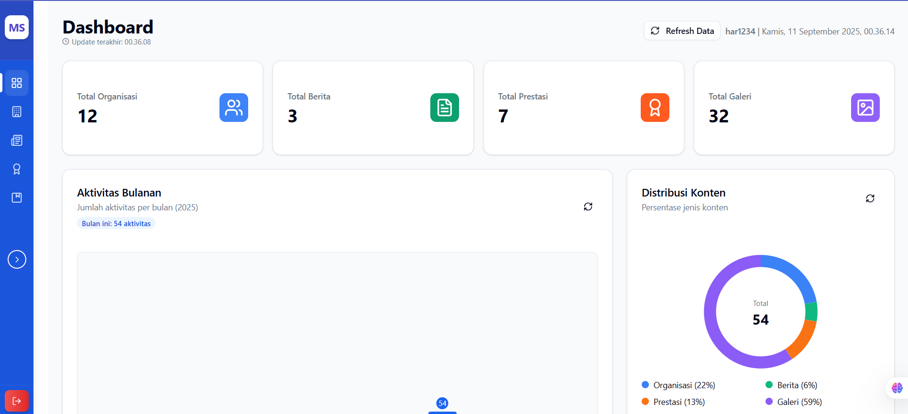

# Portal Desa Sitemu

Portal website resmi Desa Sitemu yang menyediakan informasi dan layanan untuk warga dan pengunjung. Website ini dibangun menggunakan React.js dan Vite untuk tampilan yang responsif dan performa yang optimal.

## Demo

### Frontend Website



### Admin Panel



## Tentang Desa Sitemu

Desa Sitemu suatu desa yang kaya akan budaya dan tradisi. Kami berkomitmen untuk memberikan layanan terbaik bagi warga dan pengunjung. Temukan berbagai informasi mengenai desa kami di sini.

## Sejarah

Desa Sitemu dulunya merupakan perkampungan kecil yang mempunyai perempatan jalan di tengahnya, perempatan jalan itulah orang – orang bertemu, dari barat, Timur, selatan dan utara, untuk mencari perlindungan atau mencari ilmu, pada masa itu. Dengan sering bertemunya orang – orang di perempatan jalan tersebut maka orang menamakan tempat itu adalah tempat pertemuan / tempat bertemu dalam bahasa jawa Ketemu, Kata ketemu itu yang sekarang dijadikan nama sebuah Desa, yaitu Desa Sitemu.

Desa Sitemu terbentuk pada tahun 1936 yang ditandai dengan terpilihnya kepala Desa pertama yang bernama Bpk Saji, yang lebih terkenal pada saat itu dengan sebutan Bekel Saji.

## Fitur Website

- 🏠 **Beranda** - Informasi umum tentang desa
- 👥 **Profil Desa** - Sejarah, visi dan misi desa
- 🛠️ **Layanan** - Informasi layanan publik yang tersedia
- 🏛️ **Kelembagaan** - Struktur organisasi dan kelembagaan desa
- 🖼️ **Galeri** - Kumpulan foto kegiatan desa
- 📰 **Berita** - Berita dan pengumuman terbaru
- 📊 **Prestasi** - Pencapaian dan prestasi desa
- 📞 **Kontak** - Informasi kontak dan lokasi

## Teknologi yang Digunakan

- **Frontend**: React.js, Tailwind CSS, DaisyUI
- **Build Tool**: Vite
- **Animasi**: AOS (Animate on Scroll)
- **Routing**: React Router DOM
- **Icons**: React Icons

## Pengembangan

```bash
# Clone repository
git clone https://github.com/username/portal-desa.git

# Masuk ke direktori
cd portal-desa

# Install dependensi
npm install

# Jalankan mode development
npm run dev

# Build untuk production
npm run build
```
